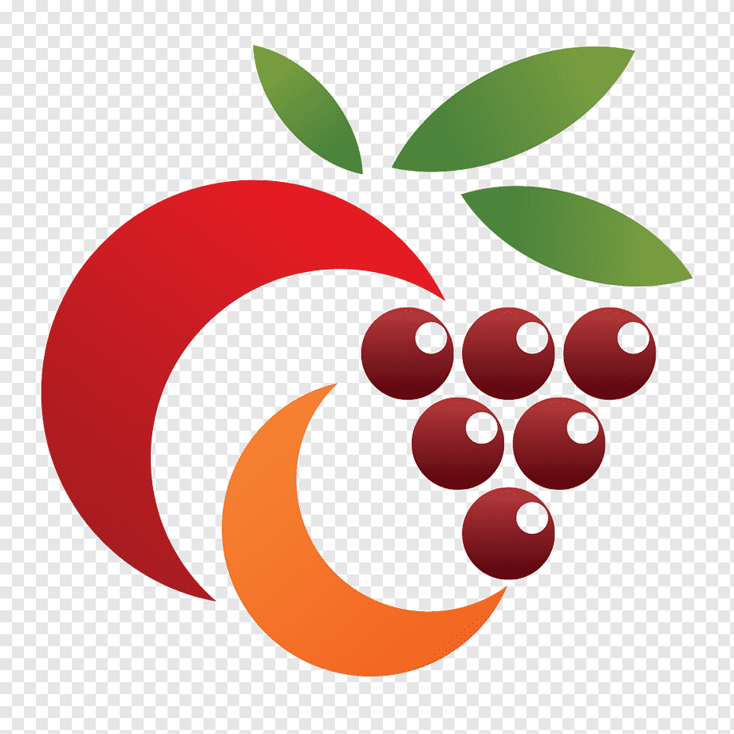

<!-- HEADINGS -->

# Mi titulo
## mi titulo
### mi titulo
#### mi titulo
#### mi titulo
##### mi titulo
###### mi titulo 
<!-- italic -->
this is an *italic* text

<!-- strong -->
this is an **strong** text

<!-- strikethrough -->
este es el ~~texto~~ tachado

<!-- UL -->

* manzana
    * manzana
* coco 
    * coco
* mango 
    * mango

1. manzana
2. coco
3. mango

{faztweb.com}(https://www.faztweb.com)

{faztweb.com}(https://www.faztweb.com ``asdasdasdas``)

this is a quote

---
____

`console.log("hello world")`


```javascript
const button = document.createElement("button");
button.innerText = 'Profile'

const isAuthorized = true;

button.addEventListener("click", () => {
  if (isAuthorized) {
    alert("Autorizado");
  } else {
    alert("No Autorizado");
  }
});

document.body.append(button);


```
```python
print("hello word")
```
```html
<h1>helloworld<h1>
```
|tables |are |cool  |
|-------|:----:|------:|
|cool 3 is|ring-aligned | $1600 |
|cool 2 is|centered  | $12   |
| zebra stripes | are neat | $1  |




<!-- GITHUB MARDOWN -->
* [X] task 1